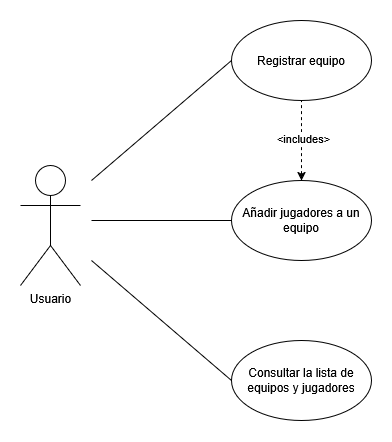
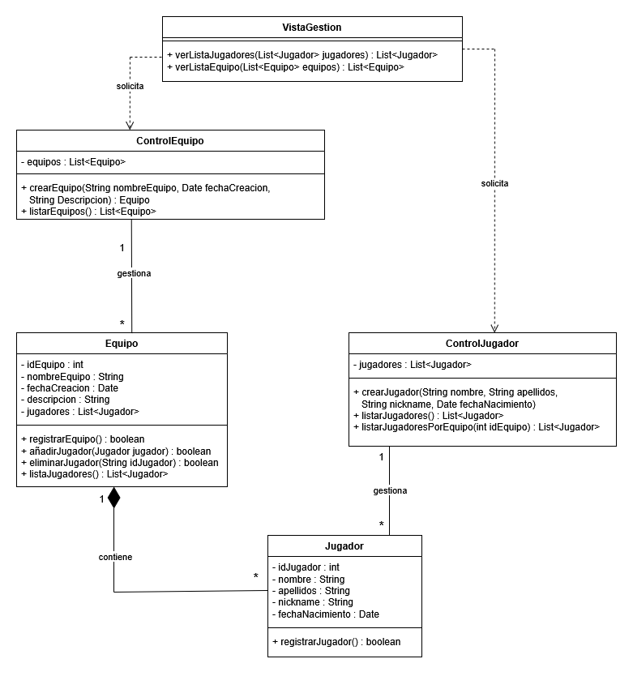

# Sistema de Gestión de Torneos de eSports

## Autor
[Ander Vilariño Lozano](https://github.com/an-vila)

## Descripción del Proyecto
[Link al repositorio del proyecto](https://github.com/an-vila/torneo-esports-uml.git)

Este proyecto implementa un sistema de gestión de torneos de eSports
utilizando UML para el modelado y Java para la implementación.

## Diagramas UML
### Diagrama de Casos de Uso


La manera en la que se accedería al sistema sería mediante el uso de una web donde
registrar tanto el equipo como los jugadores y consultar la lista. Por ello, cabe
pensar que el actor que se desencadena las acciones sea el usuario final como tal.  
El actor tiene acceso a los tres casos de uso de manera independiente, aunque cabe 
destacar que en el caso de uso de Registrar equipo se entiende que tiene que haber,
al menos, un jugador, por lo que este caso de uso incluye el caso de uso Añadir jugadores
a un equipo.
 
### Diagrama de Clases


El diagrama de clases se construye sobre el diagrama de casos de uso desarrollado 
antes.  

Consta de un par de clases modelo, otro par de clases de control y una de vista. 
Su diseño se desarolla más abajo en su punto correspondiente. 

## Estructura del Proyecto
```
torneo-esports-uml/ 
├── src/
│ ├── es/empresa/torneo/
│ │ ├── modelo/
│ │ ├── control/
│ │ ├── vista/
│ │ ├── Main.java
├── diagrams/
│ ├── casos-uso.png
│ ├── clases.png
├── README.md
├── .gitignore
```
## Instalación y Ejecución
1. Clonar el repositorio:
`git clone https://github.com/an-vila/torneo-esports-uml.git`
2. Compilar y ejecutar el proyecto:
`cd src javac es/empresa/torneo/Main.java java es.empresa.torneo.Main`
## Justificación del diseño
Por qué se eligió esa estructura y cómo se organizan las clases.
En primer lugar, se ha entendido que al sistema en el que se van a dar los casos
de uso se accederá mediante una web con sus interfaz, formularios y demás al ser
un torneo de eSports (ya que en muchos casos no es ni necesario estar de manera 
presencuial mientras se desarrolla el torneo).  
Por este motivo, se ha pensado que sería el usuario el que iniciara los procesos
en todos los casos de uso y no haria falta un administrador o algo por el estilo
(aunque se ha pensado también en añadir otro actor que fuese el admin y heredase
del usuario y que a el se le asignaran otro casos de uso más especificos de administracion
como generar emparejamientos, etc.). Se ha mantenido un esquema simple siguiendo
el enunciado.  
El resultado es un diagrama de casos de uso, donde lo más destacable es que el caso
de uso Registrar equipo incluye el de Registrar un jugador, pues se entiende que
no puede haber equipos vacíos en el torneo.

En cuanto al diagrama de clases, se ha partido de dos clases modelo donde almacenar
la información con sus atributos y sus métodos. A su vez, la clase Jugador tiene
una relación de composición con la clase de Equipo. Se entiende que los equipos
ya estan creados con anterioridad en la vida real al registrarlos en el sistema 
y que no cabe la posibilidad de que un jugador se quede suelto y que otro pueda
"adoptarlo". Asi que si un equipo se borra, tiene sentido que también lo hagan sus
jugadores. Tienen una relación de 1 a muchos, donde un equipo puede tener muchos 
jugadores y un jugador puede pertenecer a un equipo.  
De estas dos clases surgen otras dos de control, cada una con su respectivo control.
Estas dos clases de control se encargarán de gestionar la lógica de negocio y permiten
que las operaciones las gestionen las clases de negocio, manteniendo la independencia
y la encapsulación. Además también se encargan de comunicar la clase de vista con
las clases de modelo. ControlEquipo y controlJugador tienen una relación de asociación
simple con sus respectivas clases, pues las administran, pero no dependen de ellas
ni nada por el estilo. La relación es también de 1 a muchos, porque una sola clase
de control puede gestionar numerosos Equipos y Jugadores.  
Finalmente, la clase de vista es la encargada de mostrar la información que pide
al resto de clases. Cuenta únicamente con los métodos de mostrar las listas
de equipos y jugadores y tiene una relación de dependencia con las clases de control,
pues necesita de ellas para poder mostrar dicha información.

## Conclusiones


Los diagramas UML son una gran herramienta flexible que te permite empezar a moldear
algo tan abstracto como tus pensamientos en algo más tangible y encaminarlo hacia
la creación final del programa. Esta flexibilidad, acompañada de una cohesión y
justificación ayuda a establecer una de idea de qué hacer y como hacerlo.
Personalmente, esta tarea me ha hecho pensar en qué necesito para lograr mi objetivo
y que clases son necesarias y cuáles no, por ejemplo, lo que me ha ayudado a entender
bien el proceso de encapsulamiento y entender la logica de negocio, conceptos que 
conocía y sabía usar, pero que no terminaba de tener claro por qué.

